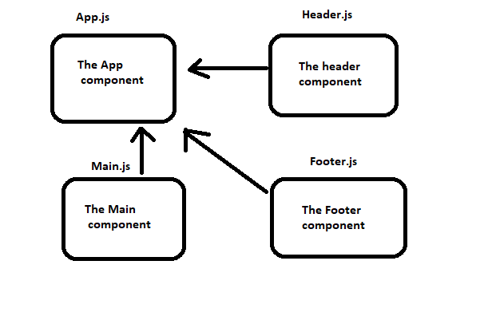

# resty

## Project: resty

### Author: Anas Zain

### Links and Resources

- [submission PR](https://github.com/401-advanced-javascript-anas/resty/pull/1)
- [Heroku]()

### Setup

#### How to initialize/run your application 

- `npm run start`

#### How to use your library 
#### Tests
- Lint test: `npm run lint`
- Code test: `npm run test`

#### UML

